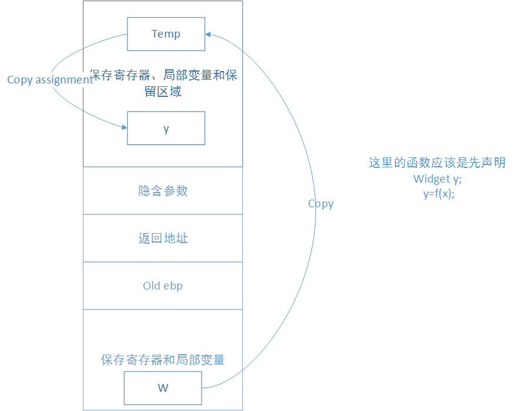
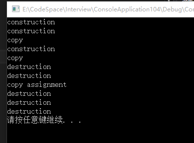
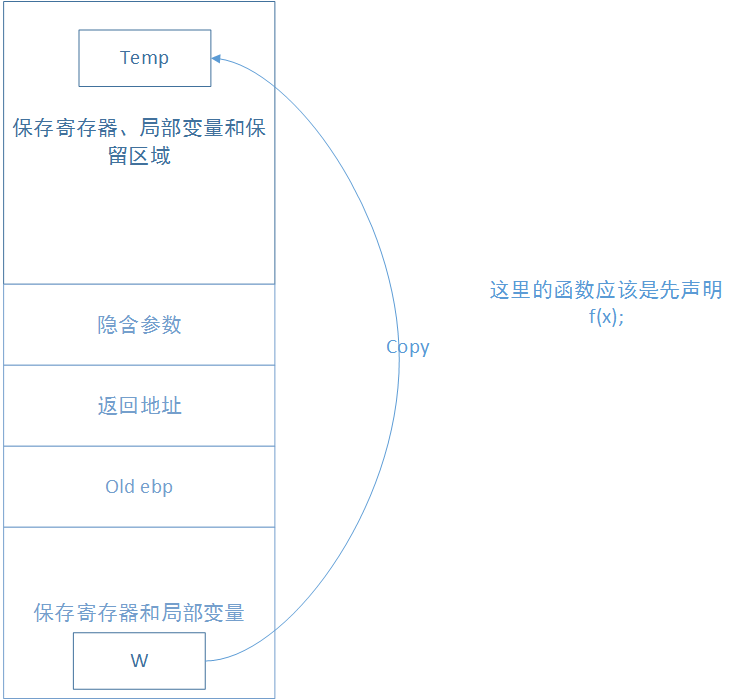
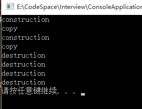
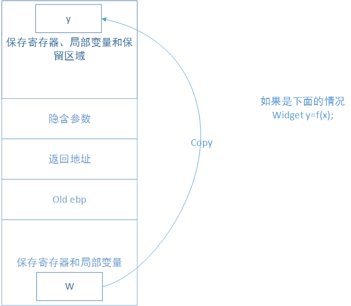
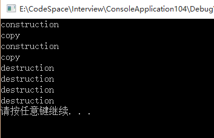

RVO是C++中提高内存

____

<!-- TOC -->

- [RVO优化是什么？](#rvo优化是什么)
- [返回值优化RVO](#返回值优化rvo)

<!-- /TOC -->
____

# RVO优化是什么？

返回值优化（Return Value Optimization，简称RVO）是一种编译器优化机制，主要是为了减少临时对象的产生。
什么是临时对象？

C++中的临时对象是不可以见的，与我们平常说的局部对象是不同的：
``` cpp
template<class T>
void swap(T& object1, T& object2) {
	T temp = object1;
	object1 = object2;
	object2 = temp;
}
```
上面的temp并不是临时对象，而是一个局部变量。
什么时候会产生临时对象？
1）为了函数调用能够成功而实施的隐式类型转换（implicit type conversions）
2）当函数返回对象的时候
首先考虑第一种情况，为了让函数调用成功而产生临时对象，这种情况发生在传递某对象给函数的参数，而其类型与它即将绑定上去的参数类型不同，此时就会产生临时对象。只有当对象以by-value方式传递或者当对象被传递给一个reference-to-const参数时，这些转换才会发生，如果对象被传递给一个reference-to-non-const参数，并不会发生转换，
第二种是会产生临时对象的情况则是当函数返回一个对象时。
临时对象可能很耗成本，所以尽量消灭临时对象的产生，任何时候reference-to-const参数都极有可能产生一个临时对象，绑定至该参数上。任何时候只要  函数返回一个对象，就会产生临时对象，并于稍后销毁。

下面简单了解一下C++中的函数是如何返回一个对象的。（以下的内存布局以Linux为例，Windows中程序的内存布局和Linux下略有不同，本文不再详述）
例如下面的程序：
``` cpp
class Widget{};
Widget f(Widget u){
   Widget w;
   return w;
} 
```

在使用这个函数的时候如果是如下图左侧调用函数f的，实际上在内存中的栈中是如下变化的：



如果我们在Widget的拷贝构造函数和赋值构造函数中加入一个输出的flag：

``` cpp
class Widget {
public:
	Widget() {
		cout << "construction" << endl;
	}
	Widget(const Widget&w) {
		cout << "copy" << endl;
	}
	Widget& operator=(const Widget& w){
		if (this != &w) {
		}
		cout << "copy assignment" << endl;
		return *this;
	}
};
Widget f(Widget u) {
	Widget w;
	return w;
}
int main()
{
	{
		Widget x;
		Widget y;
		y = f(x);
	}
	system("pause");
    return 0;
}
```

那么可以轻松的在输出中看到，



第三个construction是函数f内在构建Widget对象的时候，然后就是到了return的节奏，这时候为了
我们可以把上面构造的顺序列出来
x 构造
y 构造
u 通过x拷贝构造
w 构造
临时对象 通过w拷贝构造
u 析构
w 析构
y 通过赋值运算符获取临时对象的值
临时对象析构
y 析构
x 析构

如果是按照下面调用：




如果是上面这种调用，那么可以的到如下：




如果是下面这种调用：




得到输出结果：




上面的内存布局中并未考虑参数传递，因为更加具体的内存布局会在[程序的内存布局](../unix_c/程序的内存布局.md)中讲到。


# 返回值优化RVO

从上面的内存过程中，我们显然看到了很多不必要的拷贝，那么下面就应该想办法优化这个事情。当函数以by-value方式返回对象，总是会产生这样的临时对象。那么如何减少临时对象的产生，就能够很有效的减少copy构造函数的调用，从而减少copy函数带来的开销（假设我们的类数据成员比较多，构建比较复杂，那么copy构造函数带来的开销就会很大）。
编译器开启RVO以后会将return表达式所定义的对象构建在接受返回值的变量内：
``` cpp
Widget f(x);
Widget y=f(x);
```
在上面的代码中，由于开启了RVO，编译器会将return表达式所定义的对象构建在y的内存内，如果编译器这么做，调用函数f时的临时队形总成本为0，也就是说没有任何临时对象被产生出来。取而代之的是付出一个构造函数（用来产生y）的代价。

> 对于返回值的优化，更加建议使用C++11中的右值引用、move等
