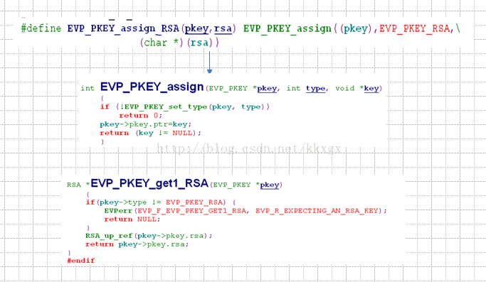

<!-- TOC -->

- [C语言 利用openssl解析证书](#c语言-利用openssl解析证书)
    - [注意的地方](#注意的地方)
    - [解析的流程](#解析的流程)
        - [从`cer/der`格式证书获取X509格式](#从cerder格式证书获取x509格式)
        - [从`crt/pem`格式证书获取X509格式](#从crtpem格式证书获取x509格式)
        - [从`p12/pfx`格式证书获取X509格式](#从p12pfx格式证书获取x509格式)
        - [解析X509结构](#解析x509结构)
            - [获取version](#获取version)
            - [获取序列号](#获取序列号)
            - [获取颁发者信息](#获取颁发者信息)
            - [获取使用者信息](#获取使用者信息)
            - [获取有效时间](#获取有效时间)
            - [获取公钥](#获取公钥)
    - [常用的openssl证书解析函数](#常用的openssl证书解析函数)
        - [`cer/der`常用解析函数](#cerder常用解析函数)
        - [`crt/pem`常用函数](#crtpem常用函数)
        - [`p12/pfx`常用函数](#p12pfx常用函数)

<!-- /TOC -->


# C语言 利用openssl解析证书
最近在完成一个利用openssl对证书进行解析的工作，因此总结一些需要注意的问题，和一些流程上的问题。

## 注意的地方
1. 之前在做pem和cer证书解析的时候时候都没有问题，但是在解析p12证书的时候一直生成的X509结构为空，在查询了资料以后，发现需在增加下面的代码：

```C
OpenSSL_add_all_algorithms();
ERR_load_crypto_strings();
```

上面的`OpenSSL_add_all_algorithms()`函数主要是用来加载算法函数和单向三列算法函数

``` C
void OpenSSL_add_all_algorithms(void)
{
    OpenSSL_add_all_ciphers();  /* 加载加密算法 */
    OpenSSL_add_all_digests(); /* 加载单向散列函数 */
}
```

其中void OpenSSL_add_all_ciphers(void)函数实现如下:

``` C

```

2. 这里还需要介绍一些公用的函数，base64编解码函数

``` C
int Base64Encode(const char * input, int length,char* buff, bool with_new_line)  
{  
    BIO * bmem = NULL;  
    BIO * b64 = NULL;  
    BUF_MEM * bptr = NULL;  
    b64 = BIO_new(BIO_f_base64());  
    if(!with_new_line) {  
        BIO_set_flags(b64, BIO_FLAGS_BASE64_NO_NL);  
    }  
    bmem = BIO_new(BIO_s_mem());  
    b64 = BIO_push(b64, bmem);  
    BIO_write(b64, input, length);  
    BIO_flush(b64);  
    BIO_get_mem_ptr(b64, &bptr);  
    //char * buff = (char *)malloc(bptr->length + 1);  
    memcpy(buff, bptr->data, bptr->length);  
    buff[bptr->length] = 0;   
    BIO_free_all(b64);   
    //return buff;  
    return length;
}  
  
int Base64Decode(char * input, int length,char* buffer, bool with_new_line)  
{  
    BIO * b64 = NULL;  
    BIO * bmem = NULL;  
    //char * buffer = (char *)malloc(length);  
    //memset(buffer, 0, length);   
    b64 = BIO_new(BIO_f_base64());  
    if(!with_new_line) {  
        BIO_set_flags(b64, BIO_FLAGS_BASE64_NO_NL);  
    }  
    bmem = BIO_new_mem_buf(input, length);  
    bmem = BIO_push(b64, bmem);  
    BIO_read(bmem, buffer, length);   
    BIO_free_all(bmem);  
    //return buffer;
    return length;
} 
```

3. 从ASN1_TIME转化为time_t

``` C
static time_t ASN1_GetTimeT(ASN1_TIME* time){
    struct tm t;
    const char* str = (const char*) time->data;
    size_t i = 0;

    memset(&t, 0, sizeof(t));

    if (time->type == V_ASN1_UTCTIME) {/* two digit year */
        t.tm_year = (str[i++] - '0') * 10;
        t.tm_year += (str[i++] - '0');
        if (t.tm_year < 70)
            t.tm_year += 100;
    } else if (time->type == V_ASN1_GENERALIZEDTIME) {/* four digit year */
        t.tm_year = (str[i++] - '0') * 1000;
        t.tm_year+= (str[i++] - '0') * 100;
        t.tm_year+= (str[i++] - '0') * 10;
        t.tm_year+= (str[i++] - '0');
        t.tm_year -= 1900;
    }
    t.tm_mon  = (str[i++] - '0') * 10;
    t.tm_mon += (str[i++] - '0') - 1; // -1 since January is 0 not 1.
    t.tm_mday = (str[i++] - '0') * 10;
    t.tm_mday+= (str[i++] - '0');
    t.tm_hour = (str[i++] - '0') * 10;
    t.tm_hour+= (str[i++] - '0');
    t.tm_min  = (str[i++] - '0') * 10;
    t.tm_min += (str[i++] - '0');
    t.tm_sec  = (str[i++] - '0') * 10;
    t.tm_sec += (str[i++] - '0');
    /* Note: we did not adjust the time based on time zone information */
    return mktime(&t);
}
```


## 解析的流程

这里主要是针对证书进行解析，我的思路是将证书读入到X509结构中，通过解析X509结构，完成对证书的解析

### 从`cer/der`格式证书获取X509格式

这里我们思考两种方式，一种是从文件指针中直接获取，一种是从字符流中获取。

``` C
unsigned char derRootCert[4096];  
unsigned long derRooCertLen;  
X509 *rootCert = NULL;   
unsigned char *pTmp = NULL;
FILE *fp = fopen(certPath,"rb");
if(fp == NULL){  
    perror("open file failed\n");  
    return -1;  
} 
derRooCertLen = fread(derRootCert,1,4096,fp);  
pTmp =  derRootCert;  
rootCert = d2i_X509(NULL,(unsigned const char **)&pTmp,derRooCertLen); 
```
certPath为证书的路径

然后获取X509结构，该结构如下：

``` C
struct x509_st  
{  
    X509_CINF *cert_info;  
    X509_ALGOR *sig_alg;  
    ASN1_BIT_STRING *signature;  
    int valid;  
    int references;  
    char *name;  
    CRYPTO_EX_DATA ex_data;  
    /* These contain copies of various extension values */  
    long ex_pathlen;  
    long ex_pcpathlen;  
    unsigned long ex_flags;  
    unsigned long ex_kusage;  
    unsigned long ex_xkusage;  
    unsigned long ex_nscert;  
    ASN1_OCTET_STRING *skid;  
    AUTHORITY_KEYID *akid;  
    X509_POLICY_CACHE *policy_cache;  
    STACK_OF(DIST_POINT) *crldp;  
    STACK_OF(GENERAL_NAME) *altname;  
    NAME_CONSTRAINTS *nc;  
#ifndef OPENSSL_NO_RFC3779  
    STACK_OF(IPAddressFamily) *rfc3779_addr;  
    struct ASIdentifiers_st *rfc3779_asid;  
#endif  
#ifndef OPENSSL_NO_SHA  
    unsigned char sha1_hash[SHA_DIGEST_LENGTH];  
#endif  
    X509_CERT_AUX *aux;  
} /* X509 */;  
  
typedef struct x509_cinf_st  
{  
    ASN1_INTEGER *version;      /* [ 0 ] default of v1 */  
    ASN1_INTEGER *serialNumber;  
    X509_ALGOR *signature;  
    X509_NAME *issuer;  
    X509_VAL *validity;  
    X509_NAME *subject;  
    X509_PUBKEY *key;  
    ASN1_BIT_STRING *issuerUID;     /* [ 1 ] optional in v2 */  
    ASN1_BIT_STRING *subjectUID;        /* [ 2 ] optional in v2 */  
    STACK_OF(X509_EXTENSION) *extensions;   /* [ 3 ] optional in v3 */  
    ASN1_ENCODING enc;  
} X509_CINF; 
```

该结构被定义在x509.h中


### 从`crt/pem`格式证书获取X509格式

通过函数`PEM_read_X509`从pem格式的文件中获取X509结构，具体步骤实例如下：

``` cpp
if(strcmp(buf10,"pem")==0 || strcmp(buf10,"crt")==0)
{
    //printf("file type is pem\n");
    rootCert=PEM_read_X509(fp,&rootCert,NULL,NULL);
}
```

上面的代码片段中，获取了X509结构。

### 从`p12/pfx`格式证书获取X509格式

与上面的两种格式不同，pfx格式的文件中保存了不止有公钥信息，还有私钥信息，通过函数`PKCS12_parse`可以从p12结构中提取有用的信息，因此进行了如下的处理：

``` cpp
PKCS12 *p12=NULL;
p12=d2i_PKCS12_fp(fp,NULL);
if(NULL == p12)
{
    printf("read p12 file error\n");
    return -1;
}
//STACK_OF(X509) *tmp_ca = NULL;
char pass[20]="";
tmp_i=PKCS12_parse(p12,pass,NULL,&rootCert,NULL);
if(tmp_i!=1)
{
    printf("[%d][%s]\n",tmp_i,ERR_reason_error_string(ERR_get_error()));
    return -1;
}
```

在上面的代码片段中，我们依然将将获取的信息提取到了rootCert中。

### 解析X509结构

首先了解一下X509的结构：

``` cpp
typedef struct x509_cinf_st {
    ASN1_INTEGER *version;      /* [ 0 ] default of v1 */
    ASN1_INTEGER *serialNumber;
    X509_ALGOR *signature;
    X509_NAME *issuer;
    X509_VAL *validity;
    X509_NAME *subject;
    X509_PUBKEY *key;
    ASN1_BIT_STRING *issuerUID; /* [ 1 ] optional in v2 */
    ASN1_BIT_STRING *subjectUID; /* [ 2 ] optional in v2 */
    STACK_OF(X509_EXTENSION) *extensions; /* [ 3 ] optional in v3 */
    ASN1_ENCODING enc;
} X509_CINF;
```

这里很容易发现，提取还是很容易的。

#### 获取version

这里主要使用的函数为`long X509_get_version`

``` cpp
tmp_l = X509_get_version(rootCert);
if(tmp_l<0){
    ERRORMSG(errMsg,"获取version失败");
    return -1;
}
else
{
    certInf->version = tmp_l;
}
```

#### 获取序列号

使用函数``

``` cpp
Serial = X509_get_serialNumber(rootCert);
if(NULL == Serial)
{
    
}
else
{
    temp_c = certInf->serialNumber;
    for(i = 0;i<Serial->length;i++)
    {
        snprintf(temp_c,sizeof(certInf->serialNumber)-2*i,"%02x",Serial->data[i]);
        temp_c += 2;
    }
    //printf("serialNumber[%s]\n",certInf->serialNumber);
}
```

#### 获取颁发者信息

``` cpp
issuer_name = X509_get_issuer_name(rootCert);
memset(tmp_buf,0x00,sizeof(tmp_buf));
tmp_i = 512;
tmp_i = X509_NAME_get_text_by_NID(issuer_name,NID_commonName,tmp_buf,tmp_i);
if(tmp_i<0)
{
    ERRORMSG(errMsg,"获取颁发者信息失败");
    return -1;
}
else
{
    strncpy(certInf->issuerName,tmp_buf,sizeof(certInf->issuerName)-1);
    //printf("[%s]\n",tmp_buf);
}
```

#### 获取使用者信息

``` cpp
pSubName = X509_get_subject_name(rootCert);
memset(tmp_buf,0x00,sizeof(tmp_buf));
tmp_i = 512;
tmp_i = X509_NAME_get_text_by_NID(pSubName,NID_countryName,tmp_buf,tmp_i);
if(tmp_i<0)
{
    
}
else
{
    //printf("NID_countryName[%s]\n",tmp_buf);
    strncpy(certInf->countryName,tmp_buf,sizeof(certInf->countryName)-1);
}

memset(tmp_buf,0x00,sizeof(tmp_buf));
tmp_i = 512;
tmp_i = X509_NAME_get_text_by_NID(pSubName,NID_organizationName,tmp_buf,tmp_i);
if(tmp_i<0)
{
    
}
else
{
    //printf("NID_organizationName[%s]\n",tmp_buf);
    strncpy(certInf->organizationName,tmp_buf,sizeof(certInf->organizationName)-1);
}


memset(tmp_buf,0x00,sizeof(tmp_buf));
tmp_i = 512;
tmp_i = X509_NAME_get_text_by_NID(pSubName,NID_organizationalUnitName,tmp_buf,tmp_i);
if(tmp_i<0)
{
    
}
else
{
    //printf("NID_organizationalUnitName[%s]\n",tmp_buf);
    strncpy(certInf->organizationalUnitName,tmp_buf,sizeof(certInf->organizationalUnitName)-1);
}


memset(tmp_buf,0x00,sizeof(tmp_buf));
tmp_i = 512;
tmp_i = X509_NAME_get_text_by_NID(pSubName,NID_commonName,tmp_buf,tmp_i);
if(tmp_i<0)
{
    
}
else
{
    //printf("NID_commonName[%s]\n",tmp_buf);
    strncpy(certInf->subName,tmp_buf,sizeof(certInf->subName)-1);
}
```

#### 获取有效时间

``` cpp
//有效期
start = X509_get_notBefore(rootCert);  
end = X509_get_notAfter(rootCert);
ttStart = ASN1_GetTimeT(start);
ttEnd = ASN1_GetTimeT(end);
timeinfo = localtime(&ttStart);
strftime(certInf->effectDate,9,"%Y%m%d",timeinfo);
timeinfo = localtime(&ttEnd);
strftime(certInf->expireDate,9,"%Y%m%d",timeinfo);
```

#### 获取公钥


首先，我们从X509的结构中通过函数`EVP_PKEY* X509_get_pubkey(X509 *x)`获取了EVP_PKEY，EVP_PKEY的结构如下：

``` C
struct evp_pkey_st  
    {  
    int type;  
    int save_type;  
    int references;  
    const EVP_PKEY_ASN1_METHOD *ameth;  
    ENGINE *engine;  
    union   {  
        char *ptr;  
#ifndef OPENSSL_NO_RSA  
        struct rsa_st *rsa; /* RSA */  
#endif  
#ifndef OPENSSL_NO_DSA  
        struct dsa_st *dsa; /* DSA */  
#endif  
#ifndef OPENSSL_NO_DH  
        struct dh_st *dh;   /* DH */  
#endif  
#ifndef OPENSSL_NO_EC  
        struct ec_key_st *ec;   /* ECC */  
#endif  
        } pkey;  
    int save_parameters;  
    STACK_OF(X509_ATTRIBUTE) *attributes; /* [ 0 ] */  
    } /* EV  
```

在这个结构中采用了共用体

这里可以通过EVP_PKEY结构中的type来判断其中的保存的公钥是采用的什么算法：

``` c
    pubKey = X509_get_pubkey(rootCert);
    if(!pubKey){
        //printf("public key is null");
    }
    else if(EVP_PKEY_RSA == pubKey->type)  
    {  
        pubKeyType = EVP_PKEY_RSA;  
        rsa = EVP_PKEY_get1_RSA(pubKey);
        //RSA_print_fp(stdout,rsa,0);
        memset(big_buf,0x00,sizeof(big_buf));
        tmp_i=rsa2str(rsa,big_buf,sizeof(big_buf));
        //printf("pubKey[%d][%d]",pubKey->type,__LINE__);
    } 
    else if(EVP_PKEY_EC == pubKey->type)  
    {  
        pubKeyType = EVP_PKEY_EC;
        ecc = EVP_PKEY_get1_EC_KEY(pubKey);
        tmp_i=ecc2str(ecc,big_buf,sizeof(big_buf));
        //printf("pubKey[%d][%d]",pubKey->type,__LINE__);
    }  
    else if (EVP_PKEY_DSA == pubKey->type)  
    {  
        pubKeyType = EVP_PKEY_DSA;  
        dsa = EVP_PKEY_get1_DSA(pubKey);
        tmp_i=dsa2str(dsa,big_buf,sizeof(big_buf));
        //printf("pubKey[%d][%d]",pubKey->type,__LINE__);
    }  
    else if (EVP_PKEY_DH == pubKey->type)  
    {  
        pubKeyType = EVP_PKEY_DH;  
        dh = EVP_PKEY_get1_DH(pubKey);
        tmp_i=dh2str(pubKey,dh,big_buf,sizeof(big_buf));
        //printf("pubKey[%d][%d]",pubKey->type,__LINE__);
    }  
    else  
    {  
        return -1;  
    }
```

对应不同的加密算法，证书中的公钥也有四种形式进行存放形式，这里仅仅针对了现行的openssl中的RSA，ECC，DSA，DH做了解析，SM2的解析会在后续补充。因此提取公钥的过程也与之类型相关，上面的代码中`ALG##2str`函数为从对应的结构中获取公钥的base64编码的字符串。

1. RSA 结构rsa.h中，其中{n,e} 表示公钥，{n, d}表示私钥

``` C
struct rsa_st  
    {  
    .....  
    BIGNUM *n;  
    BIGNUM *e;  
    BIGNUM *d;  
    BIGNUM *p;  
    BIGNUM *q;  
    BIGNUM *dmp1;  
    BIGNUM *dmq1;  
    BIGNUM *iqmp;  
        .....  
    };  
```

因为这里是从证书中提取的RSA结构，主要是获取公钥，很有可能d没有值，当然这并不妨碍我们提取公钥。从RSA结构中提取公钥的函数很清晰：`:int i2d_RSAPublicKey(RSA *rsa,const unsigned char** p)`，因此我们的提取过程如下：

``` c
static int rsa2str(RSA* rsa,char *outBuf, int outLen)
{
    int rsa_len = 0;
    RSA* pub_key = rsa;
    BIGNUM *n = NULL;
    BIGNUM *e = NULL;
    long len = 0;
    int i = 0;
    unsigned char pk_hex[8192+1];
    unsigned char* p_pk_hex = pk_hex;
    rsa_len = RSA_size(pub_key) * 8;
    memset(pk_hex,0x00,sizeof(pk_hex));
    len = i2d_RSAPublicKey(rsa,(const unsigned char**)&p_pk_hex);
    p_pk_hex = pk_hex;
    Base64Encode(p_pk_hex,len,outBuf,true);
    return rsa_len;
}
```


2. DSA结构在dsa.h中

``` C
struct dsa_st  
    {  
    ......  
    BIGNUM *p;  
    BIGNUM *q;  /* == 20 */  
    BIGNUM *g;  
    BIGNUM *pub_key;  /* y public key */  
    BIGNUM *priv_key; /* x private key */  
        ......  
    }; 
```

3. ECC结构在ecc.h

``` C
struct ec_key_st {  
    EC_GROUP *group;  
    EC_POINT *pub_key;  
    BIGNUM   *priv_key;  
} /* EC_KEY */; 
```

4. DH结构体在dh.h中定义

``` C
struct dh_st  
    {
    BIGNUM *p;  
    BIGNUM *g;  
    long length; /* optional */  
    BIGNUM *pub_key;    /* g^x */  
    BIGNUM *priv_key;   /* x */  
    } 
```


1. 从rsa结构中获取公钥

``` C
static int rsa2str(RSA* rsa,char *outBuf, int outLen)
{
    int rsa_len = 0;
    RSA* pub_key = rsa;
    BIGNUM *n = NULL;
    BIGNUM *e = NULL;
    long len = 0;
    int i = 0;
    unsigned char pk_hex[8192+1];
    unsigned char* p_pk_hex = pk_hex;
    rsa_len = RSA_size(pub_key) * 8;
    memset(pk_hex,0x00,sizeof(pk_hex));
    //RSA_print_fp(stdout,pub_key,0);
    len = i2d_RSAPublicKey(rsa,(const char**)&p_pk_hex);
    //printf("\ntest[%d][%02X][%s]\n",len,pk_hex[2],pk_hex+1);
    //for(i=0;i<len;i++)
    //    sprintf(outBuf+i*2,"%02X",pk_hex[i]);
    //printf("convert over\n");
    //n = rsa->n;
    //e = rsa->e;
    
    p_pk_hex = pk_hex;
    Base64Encode(p_pk_hex,len,outBuf,true);
    
    //char tmp_buf[4096+1]={0};
    //Base64Decode(outBuf,strlen(outBuf),tmp_buf,true);
    //
    //p_pk_hex = tmp_buf;
    //RSA* test=d2i_RSAPublicKey(NULL,(const unsigned char**)&p_pk_hex,len);
    ////test->n=n;
    ////test->e=e;
    //if(test==NULL)
    //{
    //    printf("NULL\n");
    //    char err[1024]={0};
    //    ERR_error_string(ERR_get_error(), err); 
    //    printf("Failed to DER decode public key : %s\n", err); 
    //    return -1;
    //}
    //else 
    //{ 
    //    
    //}
    //
    //printf("new Key\n");
    //RSA_print_fp(stdout,test,0);
    return rsa_len;
}
```

## 常用的openssl证书解析函数

### `cer/der`常用解析函数


### `crt/pem`常用函数

### `p12/pfx`常用函数

