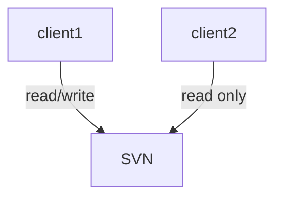

针对I/O的学习

_________

_________


``` flow 
st=>start: Start
e=>end: End
c1=>condition: A


```



# I/O复用

## select
原型：
``` cpp
int select(int nfds, fd_set *readfds, fd_set *writefds,fd_set *exceptfds, struct timeval *timeout);
```
参数：
- nfds:监听的最大的fd 加1

返回值：
- `>0`: 已经就绪的描述符的总位数
- 0：超时
- -1：出错

> select从read系统调用的角度确认是否有数据可读


# 信号驱动I/O模型
首先，信号驱动式I/O不是真正的异步I/O


# 异步I/O


# socket常用的一些函数

## shutdown函数
与close函数的区别：
1. close把描述符的引用技术减一，仅在该计数变为0时才关闭套接字。使用shutdown可以不用管引用技术直接触发TCP的正常连接终止序列(也就是发送FIN)
2. 


