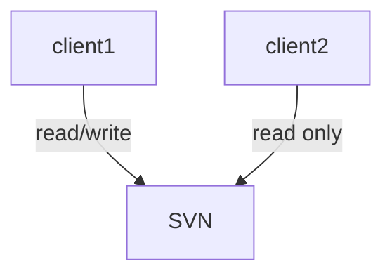

针对I/O的学习

_________

_________


``` flow 
st=>start: Start
e=>end: End
c1=>condition: A


```



# I/O复用

## select
原型：
``` cpp
int select(int nfds, fd_set *readfds, fd_set *writefds,fd_set *exceptfds, struct timeval *timeout);
```
参数：
- nfds:监听的最大的fd 加1

返回值：
- `>0`: 已经就绪的描述符的总位数
- 0：超时
- -1：出错


# 信号驱动I/O模型


# 异步I/O


